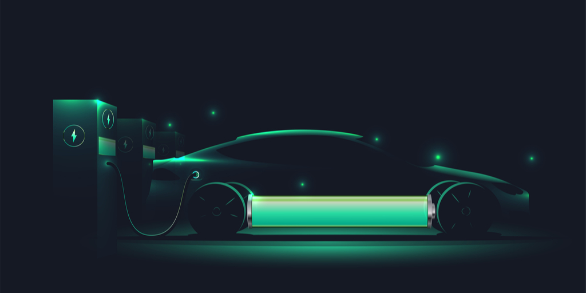

# Electric Vehicles Regression Analysis

In recent years, more and more people are buying Electrical Vehicles (EVs) for environmental, aesthetic, and financial reasons. The number of car companies inventing EVs for their brand are increasing. Companies such as Tesla, Ford, and Rivian are taking advantage of this move toward EVs. The goal of our project is to examine just how much the range of EVs changes due to other factors such as battery pack. We use multiple linear regression to estimate the relation between the range and other variables such as acceleration, top speed, battery pack, efficiency, fast charge and price in order to give us a deeper understanding of what element influences the range of EVs the most. Additionally, we can also see what car manufacturers should do to improve their EVs, and provide useful data for car companies.

